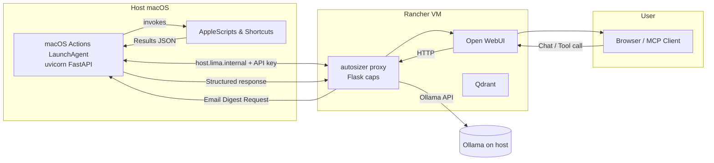

# System Flow & Validation Plan

This document captures the end-to-end architecture for the local LLM stack,
including the new macOS automation gateway, along with the phased validation
you can follow from first boot through steady-state operation.

---

## 1. High-Level Architecture



### Component roles

- **macOS Actions Gateway** (host): executes whitelisted AppleScripts/JXA and
  exposes `/scripts/*` and `/reports/email-digest` over HTTP (`127.0.0.1:8765`).
- **autosizer proxy** (container): enforces generation caps, proxies Ollama, and
  relays tool requests to the gateway via `host.lima.internal` using `OSX_ACTIONS_*` env vars.
- **Open WebUI / MCP client**: user interface. Prompts can call the digest
  endpoint once per day or hour for fresh mail/calendar summaries.
- **Ollama**: continues to serve models locally.

---

## 2. Data Flow Details

1. **Morning digest:**
   1. Open WebUI issues a tool call to autosizer (`/tool/osx/run` or direct HTTP) requesting `/reports/email-digest`.
   2. Autosizer attaches the shared API key and calls the gateway at `http://host.lima.internal:8765`.
   3. The gateway looks up the configured scripts (`unread_email_yesterday`, `meetings_today`, `new_mail_recent`), runs each via `osascript`/Shortcuts, and parses their JSON output.
   4. Aggregated response returns to autosizer, which presents summary text or structured data to the LLM for synthesis.

2. **Top-of-hour check:**
   - Either autosizer triggers the digest on a schedule or a LaunchAgent on macOS
     curls the endpoint every hour, saving the result for the LLM to ingest.

3. **Privacy boundary:**
   - Only the gateway talks to macOS automation APIs; containers never run
     AppleScript directly. All scripts are defined in `~/Library/Application Support/macos-actions/actions.yml` and gated by the API key.

---

## 3. Deployment Phases & Validation

### Phase A – Host Gateway Bring-Up

1. Copy `macos_actions/` to the Mac (`~/macos-actions`).
2. Edit `actions.yml` to point at your existing AppleScripts.
3. Create the virtualenv, install requirements, and store the API key in Keychain (SETUP.md §3–4).
4. Manual test:
   - Start uvicorn in the terminal.
   - `curl /health`, `curl /scripts/.../run`, `curl /reports/email-digest`.
   - Fix any AppleScript output issues (ensure JSON if desired).
5. Install the LaunchAgent and confirm it auto-starts on login.

**Exit criteria:** `/reports/email-digest` returns expected unread/meetings data without manual intervention.

### Phase B – Autosizer Integration

1. Update `autosizer/docker-compose.yml` with `OSX_ACTIONS_BASE` and `OSX_ACTIONS_KEY` (same value as Keychain).
2. Rebuild and redeploy autosizer (`docker compose build autosizer --no-cache && docker compose up -d autosizer`).
3. From the autosizer container, run:
   ```bash
   curl -X POST http://autosizer:8089/tool/osx/run \
     -H "X-API-Key: $OSX_ACTIONS_KEY" \
     -H "Content-Type: application/json" \
     -d '{"action":"email_digest"}'
   ```
   (Match your relay endpoint; adjust if calling direct.)
4. Observe autosizer logs for `IN/OUT` entries and confirm the gateway received the call in its logs.

**Exit criteria:** WebUI prompts can request the email digest and receive aggregated results.

### Phase C – LLM Workflow Validation

1. Create a preset or MCP tool that hits the digest endpoint at start of day.
2. Prompt the LLM: “Summarise unread threads from yesterday and today’s meetings” and verify the response includes grouped threads and optional/required attendees.
3. Schedule periodic checks (LaunchAgent or container cron) if needed.

**Exit criteria:** Daily routine (morning summary + hourly check) can be executed hands-free via LLM prompts or scheduled triggers.

---

## 4. Testing Matrix

| Scenario | Trigger | Expected Output | Primary Logs |
|----------|---------|-----------------|--------------|
| `/health` | curl | `scripts` list populated | `~/Library/Logs/macos-actions.out` |
| `unread_email_yesterday` script | curl | JSON/text describing threads | same |
| Email digest report | curl | JSON with `unread`, `meetings`, `new_mail` keys | same |
| Autosizer relay | WebUI tool | LLM sees digest text | autosizer container logs + mac logs |
| Hourly schedule | LaunchAgent | Latest unread summary stored | LaunchAgent logs |

If any test fails, re-run the host scripts manually (`osascript script.scpt`) to isolate the issue before revisiting the gateway.

---

## 5. Future Enhancements

- Add MCP server wrapper so IDE agents can discover the `email_digest` tool automatically.
- Implement secure web-search module as a separate gateway tool with outbound filtering once policy allows.
- Extend `actions.yml` with additional AppleScripts (e.g., task list, reminders) following the same pattern.

This document is the authoritative reference for how the autosizer proxy, Ollama,
and the macOS automation gateway interoperate from initial setup through normal
operation.
